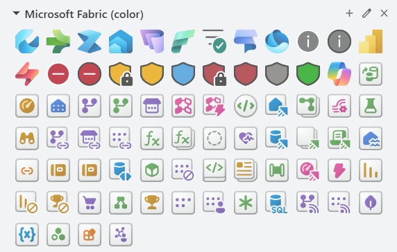
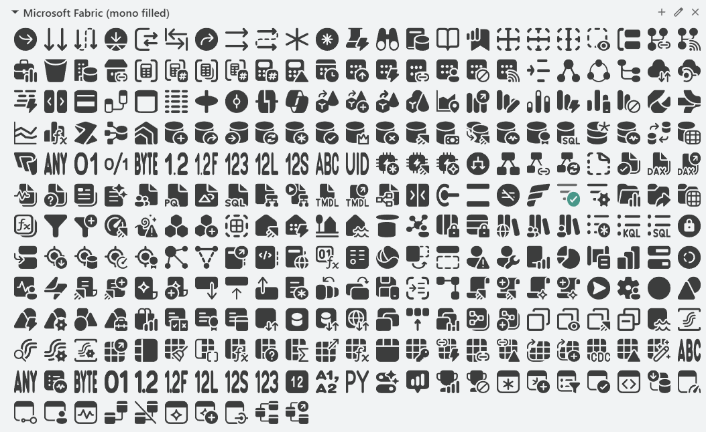
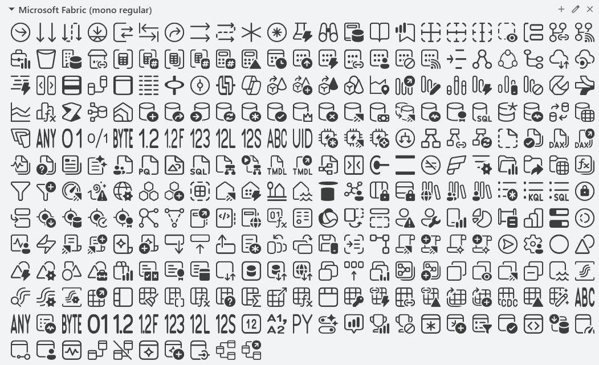
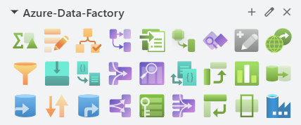

# icons and symbols

## Icons Library for DrawIO

- [Microsoft Fabric (color)](https://app.diagrams.net/?splash=0&clibs=Uhttps%3A%2F%2Fraw.githubusercontent.com%2FAzure-Player%2Ficons-and-symbols%2Frefs%2Fheads%2Fmaster%2FDrawIO-icons-library%2FMicrosoft%2520Fabric%2520(color).xml):
The icon set of Microsoft Fabric (color)
- [Microsoft Fabric (mono filled)](https://app.diagrams.net/?splash=0&clibs=Uhttps%3A%2F%2Fraw.githubusercontent.com%2FAzure-Player%2Ficons-and-symbols%2Frefs%2Fheads%2Fmaster%2FDrawIO-icons-library%2FMicrosoft%2520Fabric%2520(mono%20filled).xml):
The icon set of Microsoft Fabric (mono filled)
- [Microsoft Fabric (mono regular)](https://app.diagrams.net/?splash=0&clibs=Uhttps%3A%2F%2Fraw.githubusercontent.com%2FAzure-Player%2Ficons-and-symbols%2Frefs%2Fheads%2Fmaster%2FDrawIO-icons-library%2FMicrosoft%2520Fabric%2520(mono%20regular).xml):
The icon set of Microsoft Fabric (mono regular)

- [Azure Data Factory](https://app.diagrams.net/?splash=0&clibs=Uhttps%3A%2F%2Fraw.githubusercontent.com%2FAzure-Player%2Ficons-and-symbols%2Frefs%2Fheads%2Fmaster%2FDrawIO-icons-library%2Fazure-data-factory.xml):
The icon set of Azure Data Factory (Mapping Data Flow)

## Azure_Public_Service_Icons

Original location: https://learn.microsoft.com/en-us/azure/architecture/icons/

## Azure Data Factory - Mapping Data Flow

This folder contains icons specifically for (Mapping) Data Flow.  
Both, SVG and PNG editions available.

## SSIS (SQL Server Integration Services)

Only few icons right now.

## Microsoft-Azure-Cloud-and-Enterprise-Symbol-Icon-Set

This package contains a set of symbols/icons to visually represent features of and systems that use Microsoft Azure and related cloud and on-premises technologies.

Please open the instructions that came with this symbol set to learn how to use them in PowerPoint. PowerPoint specific video training available at [Using the Microsoft Cloud and Enterprise (CnE) Symbol set](https://youtu.be/_EKbbo9HPS4?t=4m38s).

## 🔨 Tools

- [Draw.io Desktop](https://get.diagrams.net/)
- [Other DrawIO libraries](https://github.com/jgraph/drawio-libs)  
- [Official Azure Icon Set](https://code.benco.io/icon-collection/azure-icons/)
